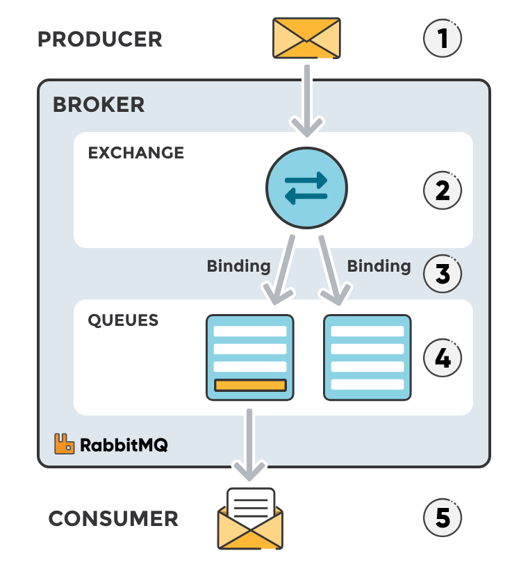

# RabbitMQ-learn

## RabbitMQ

### Standard RabbitMQ message flow

1. The producer publishes a message to the exchange.

1. The exchange receives the message and is now responsible for the routing of the message.

1. Binding must be set up between the queue and the exchange. In this case, we have bindings to two different queues from the exchange. The exchange routes the message into the queues.

1. The messages stay in the queue until they are handled by a consumer.

1. The consumer handles the message.

### [Exchange Types](https://www.cloudamqp.com/blog/part4-rabbitmq-for-beginners-exchanges-routing-keys-bindings.html)

- RabbitMQ supports several built-in exchange types, each designed to handle specific messaging patterns.

1. **Direct Exchanges**
   - **Purpose**: Direct exchanges route messages based on an exact match between routing keys.
   - **Routing Key**: The message is delivered to a queue if the routing key matches exactly with one of the bindings attached to that queue.
   - **Use Case**: Simple scenarios where each message needs to be delivered to exactly one consumer.

2. **Topic Exchanges**
   - **Purpose**: Topic exchanges are used for more flexible matching rules, based on regular expressions and wildcards.
   - **Routing Key**: The routing key can contain special characters like `*` (matches a single word) or `#` (matches zero or more words).
   - **Use Case**: Scenarios where you need to route messages based on patterns rather than exact matches.

3. **Fanout Exchanges**
   - **Purpose**: Fanout exchanges broadcast messages to all queues bound to the exchange, regardless of routing keys.
   - **Routing Key**: The routing key is ignored; fanout exchanges deliver messages to every queue that has a binding with this exchange.
   - **Use Case**: Broadcasting messages to multiple consumers without concern for specific filtering or routing.

4. **Headers Exchanges**
   - **Purpose**: Headers exchanges route messages based on message headers rather than the routing key.
   - **Routing Key**: The routing key is ignored; bindings are created using header values instead of a routing key.
   - **Use Case**: Routing messages where the decision criteria do not fit into traditional routing keys and rely more on message metadata.

### Summary

- **Direct Exchanges** route based on exact matches with routing keys, ideal for one-to-one message delivery.
- **Topic Exchanges** use wildcard patterns in routing keys to match multiple consumers.
- **Fanout Exchanges** broadcast messages to all queues bound to the exchange, suitable for scenarios where every consumer needs to receive a copy of the message.
- **Headers Exchanges** route based on headers rather than routing keys, allowing for more complex routing logic.

Understanding these exchange types is crucial when designing messaging systems in RabbitMQ. Each type serves different purposes and use cases, and choosing the right one can significantly impact system design and performance. For a detailed implementation guide and examples, refer to the full CloudAMQP blog post or official RabbitMQ documentation.

## [Naming Conventions in RabbitMQ](https://medium.com/@miralizoda.komron/naming-conventions-in-rabbitmq-84cc583e84f5#bypass)

The Medium post "Naming Conventions in RabbitMQ" by Miralizoda Komron discusses best practices and naming conventions for RabbitMQ components such as exchanges, queues, routing keys, and bindings. Here’s a summary of the key points:

### Exchanges

- **Use Descriptive Names**: Exchange names should be descriptive to indicate their purpose or type.
  - Example: `customer_event_exchange`, `user_data_exchange`.

- **Namespace Prefixes**: Include namespaces or prefixes for better organization.
  - Example: `myapp.customer_event_exchange` for an application-specific exchange.

### Queues

- **Descriptive Naming**: Similar to exchanges, queue names should be descriptive and indicate the purpose of the message queue.
  - Example: `customer_service_queue`, `user_management_queue`.

- **Avoid Hardcoded Names**: Use dynamic generation or configuration management tools to avoid hardcoding queue names in code.

### Routing Keys

- **Hierarchical Structure**: Use a hierarchical structure for routing keys, typically mimicking directory structures.
  - Example: `customer.create`, `customer.update`, `order.place`.

- **Consistency Across Applications**: Ensure consistency across applications to maintain uniformity and ease of understanding.

### Bindings

- **Documented Binding Relationships**: Clearly document the relationships between exchanges and queues via routing keys. This helps in maintaining the system and onboarding new team members.
  - Example: The `customer_event_exchange` is bound to `customer_service_queue` with a routing key `customer.create`.

- **Use of Headers and Topics**: For more complex scenarios, use headers or topics to define binding rules that are flexible and reusable.

### Common Mistakes

1. **Overly Generic Names**: Avoid overly generic names like `events`, `data`, etc.
2. **Hardcoding**: Hardcoding queue and exchange names can lead to maintenance issues.
3. **Lack of Documentation**: Not documenting bindings and routing keys leads to confusion in larger systems.

### Best Practices

- **Naming Conventions Documented**: Clearly document naming conventions for exchanges, queues, and routing keys.
- **Use Versioning or Timestamps**: For temporary queues or dynamic bindings, consider using version numbers or timestamps.
  - Example: `temp_queue_v1`, `queue_20231015`.

- **Namespace Consistency**: Maintain consistency in namespace usage across the system.
